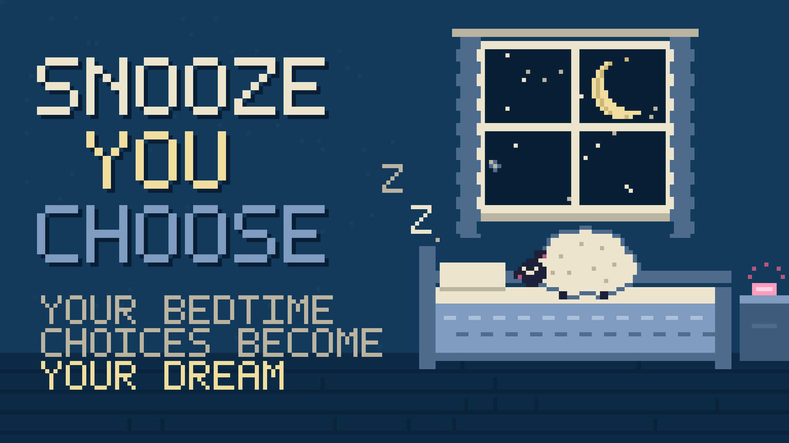
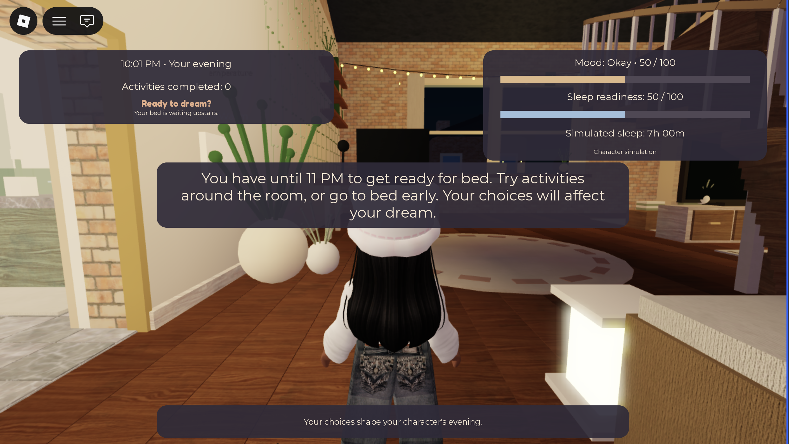
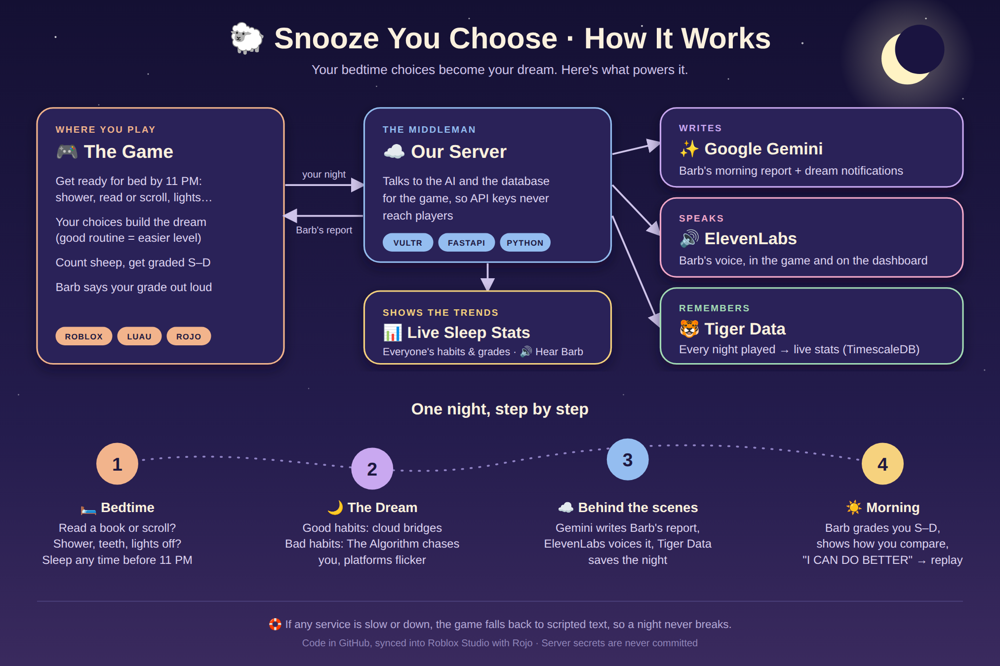

# Snooze You Choose

**Your bedtime choices become your dream.** A Roblox game about sleep habits, made for TigerHacks 2026 (theme: Health).

**[Play it on Roblox](https://www.roblox.com/games/74530686281364/Snooze-You-Choose)** · **[Live sleep stats](https://64-177-50-25.sslip.io/dashboard)** · works on phone, tablet, computer, and console



It's 10 PM in your dorm and bedtime is at 11. Read a book or doomscroll? Lights off or leave the big light on? Shower, brush your teeth, one more episode? Then fall asleep and play the dream your evening built:

- **Scrolled in bed?** The Algorithm, a giant googly-eyed phone, chases you through the dream.
- **Bright lights?** The dream glares and platforms flicker out.
- **Late heavy meal?** You're sluggish and the path won't sit still.
- **Good routine?** Cloud bridges and a calm, starry sky.

Count the sheep you didn't distract, then wake up to **Barb the Sleep Sheep**, who grades your night from S "Sleep Sensei" to D "Raccoon Energy" and gives you one thing to try tomorrow.



## How it works



| Part | What it does |
|---|---|
| **Roblox (Luau)** | The room, the evening activities, the dream course, and the morning report. The server owns choices, scoring, and checkpoints. |
| **Google Gemini** | Writes Barb's personal morning report and the notifications that haunt a scrolling player's dream. |
| **ElevenLabs** | Barb's voice: she reads your grade in the game and the latest report on the stats page. |
| **Tiger Data (TimescaleDB)** | Stores every night played (hypertable + hourly continuous aggregate) for community stats. |
| **Vultr** | Hosts the Python FastAPI backend (HTTPS via Caddy), so no API key ever reaches the game. |

If any service is slow or down, the game falls back to scripted text, so a night never breaks.

## Repository

```
src/
  client/   Room activities, dream course, morning report, start screen (UI/)
  server/   Choices, scoring, dream checkpoints, backend calls, room builders
  shared/   Dream rules, mood balancing, Barb's voice line ids
backend/
  main.py        FastAPI app (Gemini, ElevenLabs, night history)
  db.py          Tiger Data / TimescaleDB queries   schema.sql  table + aggregate
  voice.py       ElevenLabs text-to-speech          dashboard.html  stats page
docs/          Devpost story, backend deploy guide, gameplay notes, images
```

## Run it locally (for developers)

You only need this to work on the code; to play, use the Roblox link above.

**Game:** install [Rojo](https://rojo.space) 7.7, run `rojo serve` in this folder, open the place in Roblox Studio, click **Connect** in the Rojo plugin (with Play stopped), then press Play. For AI reports and stats, copy `src/server/BackendConfig.example.luau` to `src/server/BackendConfig.luau` and fill in the backend URL and game key (this file is git-ignored).

**Backend:** see [docs/BACKEND_DEPLOY.md](docs/BACKEND_DEPLOY.md).

```bash
cd backend
python3 -m venv venv && venv/bin/pip install -r requirements.txt
cp .env.example .env            # Gemini, ElevenLabs, and Tiger Data keys
venv/bin/python check_setup.py  # checks every connection
venv/bin/uvicorn main:app --reload
```

## Docs

- [Devpost story](docs/DEVPOST_STORY.md)
- [Dream gameplay](docs/DREAM_GAMEPLAY.md) · [Bedtime routine](docs/BEDTIME_GAMEPLAY.md) · [The bedroom](docs/COZY_BEDROOM.md)
- [Backend deploy](docs/BACKEND_DEPLOY.md) · [Rojo setup (PDF)](docs/Roblox_Rojo_instructions.pdf)

Sleep tips are inspired by CDC guidance. Dream Stability and grades are game scores, not health measurements.
